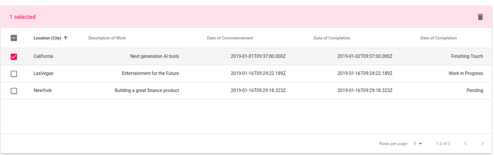

A basic Material-UI boilerplate code that can be integrated to any backend and database to function as a full-stack Table component to any app which needs to render a Table component from a data-list.

It has the standard design feature, like only after a checkbox is selected the top toolbar containing the delete or edit functionality will be shown, paginataion where user will be able to select the number of rows (i.e. data points) to be shown in a page.

`npm install`

`npm start`

